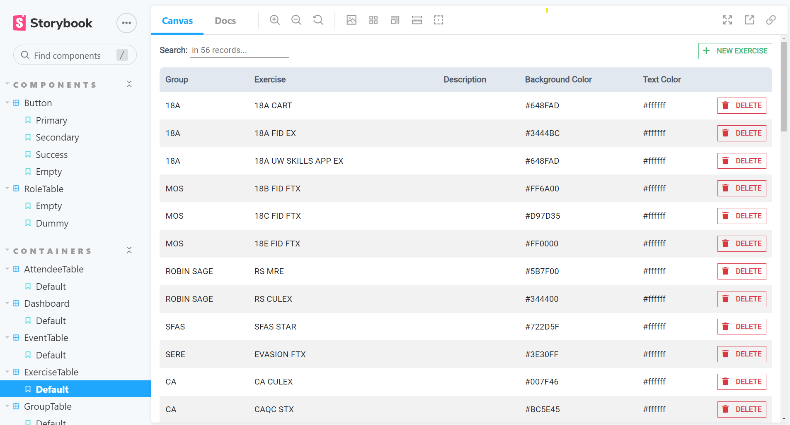
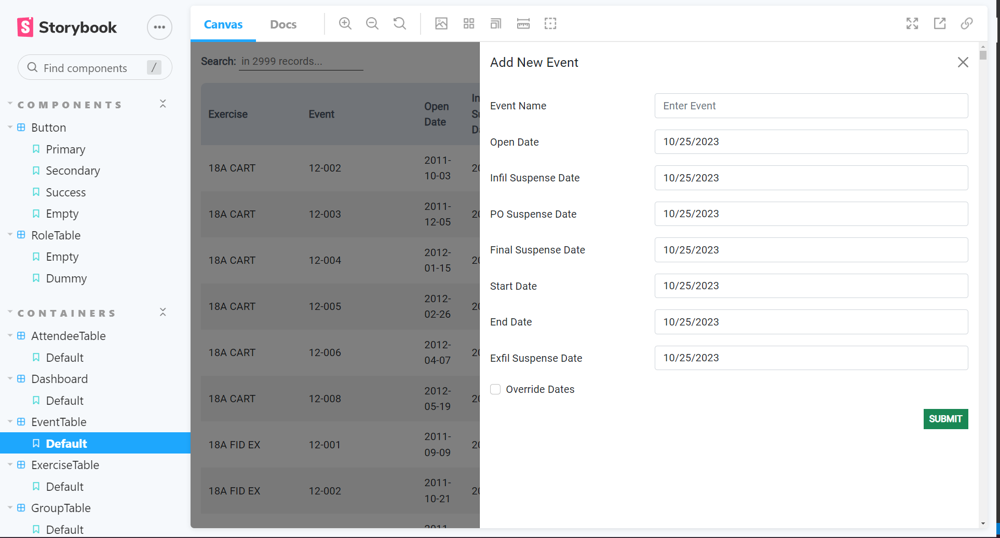
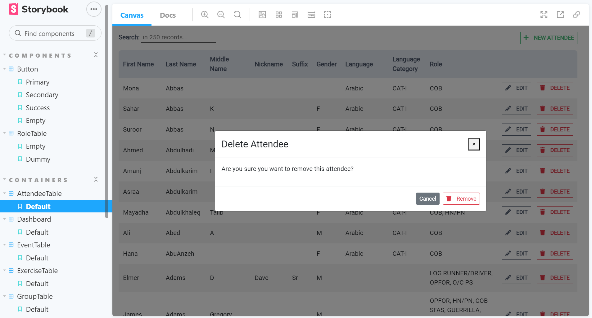
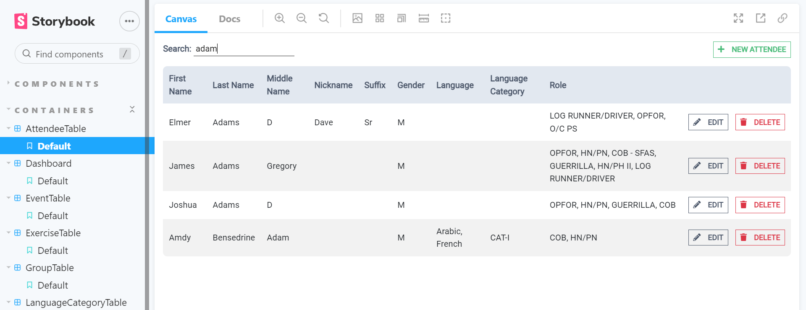

# OG COP UI Library

Let's make things easy (and beautiful :sparkling_heart:)

- [OG UI Library](#og-ui-library)
  - [Supported components](#supported-components)
  - [Supported containers](#supported-containers)
  - [Build new version](#build-new-version)
  - [Run Storybook](#storybook)
  - [Integration with other projects](#integration-with-other-projects)
  - [Upgrade UI Library version](#upgrade-ui-library-version)
    - [Input params:](#input-params)
    - [Script flow:](#script-flow)

## Supported components

- [x] Buttons (variant: add, delete, save changes, cancel, and loader)
- [x] Drawer
- [x] Divider
- [x] Icons:
  - [x] IconAwesome
  - [x] IconLabel
- [x] InfoBar (__WellInfo__ previously)
- [x] ModalDialog
- [x] Table
- [x] TableFilter
- [x] Preloader

## Supported containers

- [x] BaseTable
- [x] AttendeesTable
- [x] Dashboard
- [x] EventTable
- [x] ExcerciseTable
- [x] GroupTable
- [x] LanguageTable
- [x] LanguageCategoriesTable
- [x] RoleTable
- [x] SiteTable
- [x] UserTable

## Run local version of library

Install dependencies with `yarn install` or `npm install`.

Run `yarn dev` or `npm run dev` to start local dev server (will be run on http://localhost:6006).


## Build new version

`yarn build`

## Storybook
Build storybook `yarn sb:build` or `npm run sb:storybook`

Run `yarn sb:start` or `npm run sb:start` to start local dev server (will be run on http://localhost:6006).

Container in Storybook



Add new item with a form in Drawer



Delete item confirmation with Modal Dialog



Table search filter


## Integration with other projects

To add the UI library for a first time:

`npm i og-ui` or `yarn add og-ui`

To upgrade the current version:

`npm update og-ui` or `yarn upgrade og-ui`

## Upgrade UI Library version

When time to update library comes (new components added or improved), follow next steps to update the library version.

- **Be sure that your code is well tested, then commit it**
- Increase verion number inside `package.json` and commit this change
- [Build new version](#build-new-version) and commit results (`TODO: add gitlab worker to build new version`)
- Update related projects (`yarn upgrade og-ui` or `npm update og-ui`)


### Input params:

- commit message (string)
- release type (oneOf: ['patch','major','minor'])

Patch example: 1.0.1 -> 1.0.2 (Increment the third digit)
Minor example: 1.0.12 -> 1.1.0 (Increment the middle digit and reset last digit to zero)
Major example: 1.3.54 -> 2.0.0 (Increment the first digit and reset middle and last digits to zero)

Details: https://docs.npmjs.com/about-semantic-versioning

### Script flow:

- run build and then build:docs command
- commit and push changes to git (need to ask comment message as a param)
- change package version (`npm version <update_type>`, see `release type` input param)
- publish changes to npm (`npm publish`)


## Use in \<script\/\>

```html
<script
  src="https://unpkg.com/react@17/umd/react.development.js"
  crossorigin
></script>
<script
  src="https://unpkg.com/react-dom@17/umd/react-dom.development.js"
  crossorigin
></script>
<script
  src="https://unpkg.com/og-ui-library/dist/og-ui-library.umd.js"
  crossorigin
></script>

...

<script type="text/javascript">
  var placeHere = document.getElementById("content-table-inner");
  var Button = OgUiLib.Button;

  const domContainer = document.getElementById("content-table-inner");
  ReactDOM.render(
    React.createElement(Button, { label: "Victory 😃", size: "large" }),
    domContainer
  );
</script>
```
